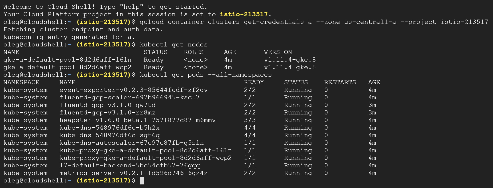

# Cloud Native Infrastructure - from Zero to Hero

This sample shows:
- how to deploy the Kubernetes, Istio and Knative stack (KIK)
- how to build and deploy application on top of KIK stack
- how to scale application from 0 up to virtually unlimited number of instances
- how to orchestrate blue-green deployments

## Kubernetes
We are going to leverage GKE cluster as a tribute to https://github.com/GIFEE/GIFEE

Create cluster:


2 nodes, 2vCPUs, 7.5GB memory, latest Kubernetes version and additional thing in advanced edit..


Enable auto-scaling, preemptible nodes (they are almost 4 times cheaper!) and auto-upgrade


Save settings, push the Create button and when cluster is ready push the Connect button and Run In Cloud Shell 


Check the state of you cluster using `kubectl get nodes` and `kubectl get pods --all-namespaces` commands



If Nodes are Ready and Pods are Running, we are good to go to the next step.

## Istio

Grant cluster-admin permissions to the current user:
```
kubectl create clusterrolebinding cluster-admin-binding \
--clusterrole=cluster-admin \
--user=$(gcloud config get-value core/account)
```

And install Istio. `kubectl apply --filename https://raw.githubusercontent.com/knative/serving/v0.2.2/third_party/istio-1.0.2/istio.yaml`


<!-- If you see "unable to recognize ..." errors, just apply the previous command again -->
<!--  -->

Wait until all Istio Pods will be in the Running or Completed state


And we are good to go to the Knative stage

### Knative
Install Knative: `kubectl apply --filename https://github.com/knative/serving/releases/download/v0.2.2/release.yaml`, wait until all the Pods are Running and label the default namespace to inject istio-proxy automatically: `kubectl label namespace default istio-injection=enabled`


Create docker-secret.yaml and update `BASE64_ENCODED_USERNAME` and `BASE64_ENCODED_PASSWORD` fields to store your Docker Hub credentials:
```yaml
apiVersion: v1
kind: Secret
metadata:
  name: basic-user-pass
  annotations:
    build.knative.dev/docker-0: https://index.docker.io/v1/
type: kubernetes.io/basic-auth
data:
  # Use 'echo -n "username" | base64' to generate this string
  username: BASE64_ENCODED_USERNAME
  # Use 'echo -n "password" | base64' to generate this string
  password: BASE64_ENCODED_PASSWORD
```
Create service-account.yaml to link the build process to the secret.
```yaml
apiVersion: v1
kind: ServiceAccount
metadata:
  name: build-bot
secrets:
  - name: basic-user-pass
```

Install Kaniko template to build containers: `kubectl apply --filename https://raw.githubusercontent.com/knative/build-templates/master/kaniko/kaniko.yaml`

Apply Secret manifest: `kubectl apply -f docker-secret.yaml` and Service Account manifest: `kubectl apply -f service-account.yaml`


### Build and Run the Code

This sample uses `github.com/mchmarny/simple-app` as a basic Go application, but you could replace this GitHub repo with your own. The only requirements are that the repo must contain a Dockerfile with the instructions for how to build a container for the application.

Create the `service.yaml` to define how to build and deploy the code (don't forget to update {DOCKER_USERNAME} fields):

```yaml
apiVersion: serving.knative.dev/v1alpha1
kind: Service
metadata:
  name: app-from-source
  namespace: default
spec:
  runLatest:
    configuration:
      build:
        apiVersion: build.knative.dev/v1alpha1
        kind: Build
        spec:
          serviceAccountName: build-bot
          source:
            git:
              url: https://github.com/mchmarny/simple-app.git
              revision: master
          template:
            name: kaniko
            arguments:
            - name: IMAGE
              value: docker.io/{DOCKER_USERNAME}/app-from-source:latest
      revisionTemplate:
        spec:
          containerConcurrency: 1
          container:
            image: docker.io/{DOCKER_USERNAME}/app-from-source:latest
            imagePullPolicy: Always
            env:
            - name: SIMPLE_MSG
              value: "Hello from the sample app!"
```

Apply the manifest: `kubectl apply -f service.yaml` and watch the result `kubectl get pods --watch`.
Once you see the deployment pod switch to the running state, press Ctrl+C to escape the watch. Your container is now built and deployed!


Knative applications exposed via knative-ingressgateway, let's figure out the external IP: `kubectl get svc knative-ingressgateway --namespace istio-system` and expected URL for our service: `kubectl get ksvc app-from-source  --output=custom-columns=NAME:.metadata.name,DOMAIN:.status.domain`

Then, let's make the request to see the result: `curl -H "Host: app-from-source.default.example.com" http://{IP_ADDRESS}`


It works!

Now, I suggest you to repeat the whole process from scratch and then follow to the next step.

## Auto-scaling

By default, Knative will scale your application down to zero pods if there is no traffic to it during the 10-minutes range. Make a cup of coffee, drink it and the run the `kubectl get pods`. Now there is no active pods of your app. Try to curl it again and you will see how quickly it will respond:


Knative promises that it will scale your application if detects the increased load, Let's test it out using the `fortio` tool. Install it `curl -L https://github.com/fortio/fortio/releases/download/v1.3.0/fortio-linux_x64-1.3.0.tgz  | sudo tar -C / -xvzpf -` and run the server `fortio server &`


Now, push the traffic to our application: `fortio load -qps 9999  -c 100 -t 10m -H  "Host: app-from-source.default.example.com"  http://IP_ADDRESS`. Run the **second console** and watch the number of pods in the default namespace: `kubectl get pods --watch`. If there are not enough nodes for our pods, GKE will provision new node for you, since we've enabled the autoscaling during the very first step. You can check the number of nodes using the `kubectl get nodes` command using third console or just wait until fortio finished the test.


You can notice that some pods are still in the Pending mode. The reason is that we configured Kubernetes autoscaling up to 4 nodes and GKE is not able to provision 5th node to host required pods. So that we can control our costs and make sure we never went wild. 

When fortio finished the test, we can analyze the result:


As you can see, we were not able to serve 1.6% of all requests. Also, 50% of our calls were finished in less than 0.15 seconds, 75% - in less than 0.27s, 90% in less than 0.45 and 99 were served in more than 1 second. 

Not Bad!? Considering the fact that we've served 425.5 qps... you decide!

Now, I suggest you to repeat the whole process again, play with it, and then go ahead to the blue/green deployment stage.

## Blue/Green deployment

Okay, let's define the second version of our app, where the environment variable will be initialized using different value. Copy the `service.yaml` file to `service2.yaml` and change the value of `SIMPLE_MSG`:

```yaml
apiVersion: serving.knative.dev/v1alpha1
kind: Service
metadata:
  name: app-from-source
  namespace: default
spec:
  runLatest:
    configuration:
      build:
        apiVersion: build.knative.dev/v1alpha1
        kind: Build
        spec:
          serviceAccountName: build-bot
          source:
            git:
              url: https://github.com/mchmarny/simple-app.git
              revision: master
          template:
            name: kaniko
            arguments:
            - name: IMAGE
              value: docker.io/ochorny/app-from-source:latest
      revisionTemplate:
        spec:
          containerConcurrency: 1
          container:
            image: docker.io/ochorny/app-from-source:latest
            imagePullPolicy: Always
            env:
            - name: SIMPLE_MSG
              value: "Hello from the samle app v2!"
```

Pay attention to the `runLatest` section of our Service definition. It makes sure that when we build and deploy the new version of our application, it will serve only latest revision of it. So that our calls will return `"Hello from the samle app v2!"`. Let's verify: `kubectl apply -f service2.yaml`


Now, we'd like to deploy the third version of the app and serve users in the 50/50 manner: 50% of reuests should be forwarded to version 2 and 50% - to the version 3. Let's create service3.yaml:

```yaml
apiVersion: serving.knative.dev/v1alpha1
kind: Service
metadata:
  name: app-from-source
  namespace: default
spec:
  release:
    revisions: ["app-from-source-00002", "app-from-source-00003"]
    rolloutPercent: 50
    configuration:
      build:
        apiVersion: build.knative.dev/v1alpha1
        kind: Build
        spec:
          serviceAccountName: build-bot
          source:
            git:
              url: https://github.com/mchmarny/simple-app.git
              revision: master
          template:
            name: kaniko
            arguments:
            - name: IMAGE
              value: docker.io/ochorny/app-from-source:latest
      revisionTemplate:
        spec:
          containerConcurrency: 1
          container:
            image: docker.io/ochorny/app-from-source:latest
            imagePullPolicy: Always
            env:
            - name: SIMPLE_MSG
              value: "Hello from the samle app v3!"
```
The main difference is in the new keyword `release` where we've defined `revisions: ["app-from-source-00002", "app-from-source-00003"]` and `rolloutPercent: 50`. Now, let's apply this definition `kubectl apply -f service3.yaml` and check the result:


It works! Now you can try to push the load again `fortio load -qps 9999  -c 100 -t 10m -H  "Host: app-from-source.default.example.com"  http://IP_ADDRESS` and check how both versions will be scaled by Knative in order to serve our requests:


Much better results than in previous attempt, but it totally makes sense, since we enabled two instances initially versus only one instance from the first experiment.

And, speaking of blue/green deployment, if you are happy with version 3 of your app, you can increase the `rolloutPercent: 50` to the desired value, until you will rollout v3 for 100%.

Now, delete everything and try to repeat all the steps again. Feel the power of cloud native infrastructure :) Stay tuned! 